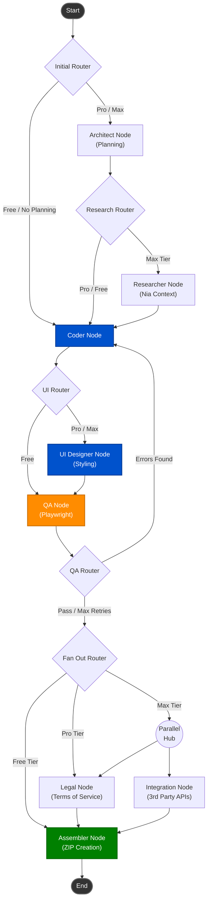

<div align="center">

<br/>

# 🦸‍♂️ Sidekick Engine

**The Autonomous Chrome Extension Builder Backend.**  
*Powering [Extensy](https://extensy.dev) — From natural language to production-ready extensions.*

<br/>

[](https://langchain-ai.github.io/langgraph/)
[](https://typescriptlang.org)
[](https://anthropic.com)
[](https://playwright.dev)

</div>

---

## ✨ What is Sidekick?

Sidekick is a powerful, agentic workflow engine built on top of **[LangGraph](https://langchain-ai.github.io/langgraph/)**. It acts as the "brain" for the Extensy SaaS platform. 

Sidekick doesn't just write code; it **plans, researches, designs, tests, and packages** logic. It orchestrates multiple specialized LLM-powered nodes working in tandem to automatically generate, style, test, and render production-ready Chrome Extensions.

---

## 🎬 The End-to-End Workflow

From the moment a user submits a prompt, Sidekick and Extensy work together through a complex, multi-stage pipeline:

```
User Prompt ("Build a dark mode toggler")
        ↓
[ Sidekick Engine ]
  ├── 1. Architect Node  → Plans file structure & permissions
  ├── 2. Coder Node      → Writes raw Manifest V3, background workers, content scripts
  ├── 3. UI Node         → Refines aesthetics (glassmorphism, micro-animations)
  ├── 4. QA Node         → Headless Playwright verifies extension loads without errors
  └── 5. Assembler Node  → Zips the extension & streams JSON back to Extensy
        ↓
[ Extensy Frontend ]
  ├── User edits code in browser IDE
  ├── Extensy AI generates Promo Slides based on Sidekick codebase
  └── One-click publish to Chrome Web Store
```

---

## 🖼️ AI Promo Slides Generation (Extensy Integration)

While Sidekick generates the raw extension codebase, it integrates directly with the **Extensy Promo Slide Pipeline** to ensure extensions look incredible on the Chrome Web Store:

1. **Feature Extraction**: Extensy's AI reads the Sidekick-generated scripts and extracts the **Core Tagline** and **Top 5 Features**.
2. **Duotone Design System**: It visually renders these details into 5 high-resolution (1280×800) slides using curated duotone palettes (e.g., Amber/Rose, Teal/Indigo).
3. **Automated Upload**: During publication, the ZIP bundle created by Sidekick and the screenshots generated by the renderer are automatically uploaded to the Chrome Web Store via Google OAuth.

---

## 🧠 LangGraph Node Architecture

Sidekick's internal flow uses a dynamic graph state machine.



### 🧩 The Nodes

| Node | Responsibility |
|------|----------------|
| **`architect_node`** | Extracts a structured blueprint (permissions, features) from the prompt using `claude-sonnet-4-5`. |
| **`researcher_node`** | Pulls MV3 patterns & design context from the **Nia API** (Max tier only). |
| **`coder_node`** | The heavy lifter. Writes the `manifest.json`, background, and content scripts. |
| **`ui_designer_node`** | Upgrades raw HTML/CSS/JS with modern aesthetics (glassmorphism, micro-animations, dark mode). |
| **`qa_node`** | Spawns headless Playwright Chromium, loads the unpacked extension, and checks for console errors/crashes. |
| **`legal_node`** | Drafts a custom Terms of Service and Privacy Policy, saving to Supabase. |
| **`integration_node`** | Adds rate limiting and error handling for 3rd party APIs detected in the code. |
| **`assembler_node`** | Packages the finalized code map into a ZIP archive buffer and streams it to the client. |

---

## 💎 Dynamic Subscription Tiers

Sidekick dynamically routes graphs and chooses LLMs (`Haiku` vs `Sonnet`) based on the user's Extensy subscription tier to balance capability and scale.

| Feature / Tier | `Free` 🐣 | `Pro` 🚀 | `Max` 👑 |
| :--- | :---: | :---: | :---: |
| **Model** | `claude-haiku-4-5` | `claude-sonnet-4-5` | `claude-sonnet-4-5` |
| **Planning Module** | ❌ | ✅ | ✅ |
| **UI Aesthetics** | ❌ | ✅ | ✅ |
| **Playwright QA** | ❌ | ✅ | ✅ |
| **Legal / TOS** | ❌ | ✅ | ✅ |
| **Nia Search / Research Context** | ❌ | ✅ | ✅ |
| **API Wiring** | ❌ | ❌ | ✅ |

---

## 🚀 Quick Start (Local Development)

### 1. Prerequisites
Ensure your `.env.local` is populated with the necessary keys. The dependencies should be installed:

```bash
npm install
npx playwright install chromium
```

> **Note on Secrets**: Keep `.env.local` uncommitted. Sidekick uses reference variables internally.
> **Tip**: Run these commands from the repository root so Playwright and TypeScript resolve the local project files correctly.

### 2. Running the Engine
You can run the full pipeline locally. The engine is written in TypeScript and executed via `ts-node`:

```bash
npm run start
# or manually:
npx ts-node src/graph.ts
```

### 3. Modifying the Input Prompt
To test different extension ideas, edit the `initialState` object at the bottom of `src/graph.ts`:

```typescript
const initialState: Partial<ExtensyState> = {
  user_prompt: "Build an extension that tracks time spent on different tabs with a beautiful dashboard.",
  subscription_tier: "max",   // "free" | "pro" | "max"
  planning_mode: true,
};
```

---

## 📂 Serverless Artifact Output

When running in Vercel (`VERCEL=1`), Sidekick handles filesystem operations seamlessly:

- **In-Memory Writing**: Avoids disk saves and streams the final ZIP directly.
- **Serverless Playwright**: Uses `@sparticuz/chromium` for lightning-fast headless execution in AWS/Vercel Lambdas.

When running natively, artifacts are dumped to:
- `./output/<name>_<timestamp>.zip` (Packaged archive)
- `./tmp/extension/` (Raw files used during QA testing)

---

<div align="center">
  <sub>Part of the <a href="https://extensy.dev">Extensy</a> Ecosystem</sub>
</div>
